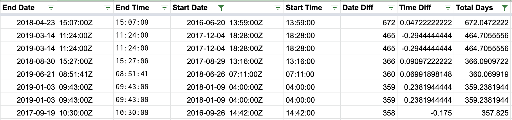

# California Wildfires: An Analysis
An analysis of California Wildfires, 2013-2020. 

By Srujay Korlakunta. 

Link to Google Sheet: [here](https://docs.google.com/spreadsheets/d/1rExJMaAEiaiRb1maou204j6620tCPqnm6Vu4wLpOJio/edit?usp=sharing) (Excel file is also in the repo)

### Analysis

Before doing the analysis, I first cleaned the data. Mainly, I deleted errant rows, such as fires from Mexico or Nevada, or fires with errant dates such as those that started in 1969. 

#### Question 1: How long do California forest fires last?

To do this, I had to first extract the meaningful components of the "Started" and "Extinguished" columns of the data, which were in an odd format. I mainly used 2 Google Sheets formulas to do this: `SPLIT`, which splits a string on a certain character, and `MID`, which allows you to get a certain portion of a string given a start position and end position.

#### Question 2: Which 5 counties had the most fires, and which 5 had the most major incidents? Are these groups different?

To do this, I primarily used pivot tables. For which 5 counties had the most fires, I used a pivot table with rows as counties, and values as COUNTA of counties. For the pivot table with the major incidents, the key thing that I did was add a filter that only kept the rows where the "MajorIncident" column was TRUE. I then used rows as counties, and values as COUNTA of counties. I then copied out the results of these pivot tables, and sorted them based on count!

#### Question 3: What time of day did most fires start?

For this question, I had to do some more string parsing on the times. I used the 'Start Time' column from my analysis of Question 1, and then did a further `MID` formula that allowed me to just extract the hour from the date. I then created a pivot table using the Start Hour as the rows, and COUNTA of the Start Hour as the values!

#### Question 4: How many acres of land were burned per year?

This question involved primarily a pivot table, where the rows were Years, and the values were the SUM of AcresBurned.

#### Question 5: Are the number of major incidents getting worse?

Here, I created two pivot tables: one with the number of major incidents per year (filtered MajorIncident to true, rows as Year, values as COUNTA Year) and the second with the number of fires per year (rows as Year, values as COUNTA Year). I then also calculated a side table that was the percent of fires each year that were counted as major incidents.

### Visualizations

### Story

The main takeaway I’d like for my story to have: are wildfires in California getting worse, where are they located, and *can we predict them* using data? This is including “worse” by different measures, such as frequency (number of fires per year), severity (amount of damage each year), and with regard to health (air quality/smoke, which I'd explore more in the future with another dataset). 

From my analysis, I was able to get some answers to these, primarily for the first and second parts of the story. My final two pivot tables (showing number of acres burned per year and number of major incidents per year) show that both values, while fluctuating, have increased overall since 2013. In fact, between 2016 and 2018, the number of acres burned by wildfires went up by nearly 800%, although 2019 was a much better year for wildfires and fires seemed to have been contained relatively quickly (or the data is incomplete). Also, the answer to if the number of major wildfire incidents per year is going up is similar; although it increased from 2013 to 2019, 2019 represented quite a bit of drop off from 2018 (again, could be because of lack of reporting). 

The visualizations above show the "where they are located" component, with Riverside County having far more fires than all others. The counties that are most affected by wildfires are mostly the same as the ones in which major fires appear. Riverside, San Diego, Butte, and Shasta appear in the top 5 of both lists.

For the "can we predict them?" component of my story, I'd build on my existing analysis by using an additional dataset (shown below) to use environmental conditions as an indicator for wildfires, as well as a source at the Riverside County Fire Department that could provide insight into how they currently approach predicting fires using patrols, etc.

My other analysis yielded other interesting results. Most fires start in the afternoon, with the peak being around 2pm. And finally, the average California wildfire lasts 84 days, with the longest being 672 days (almost 2 years).

**Other datasets** I’d like to bring in include the following datasets from Kaggle:
 * “California Environmental Conditions Dataset": [link to CSV](all_conditions.csv), [link to Kaggle](https://www.kaggle.com/chelseazaloumis/cimis-dataset-with-fire-target)

My first dataset on environmental conditions includes things like precipitation levels and air temperatures for California counties. I think it would be interesting to be able to use environmental characteristics to be able to predict if an area is fire-prone at any given time. If you could find a correlation between a few columns and the presence of a fire, you could prevent a lot of damage. 

 * “California Air Quality“: [link to CSV](California_airquality.csv), [link to Kaggle](https://www.kaggle.com/thaddeussegura/california-air-quality-2020-through-sept10th)

My second dataset is on CA air quality. Although the original dataset has a lot on the land damage (acres burned, structures damaged), it doesn’t talk about the adverse health effects of breathing in low quality air. I’d like to analyze how much of a detriment the increase in wildfires is causing in different areas.

**If I could talk to two people about this**, I’d speak to: 
 * Bill Weiser, the Riverside county Fire Chief. Adding more to my desire to be able to predict fireprone areas, I’d like to speak with him about what their current strategy is for tackling fires before they are too large. His phone number is (951) 940-6900. 
 * John R. Balmes, MD, Physician Member of the California Air Resources Board. I’d like to speak with him more about the adverse health effects of smoke caused by fires, and what we can do to keep ourselves safe from secondhand smoke. His phone number is (628) 206-8314.

